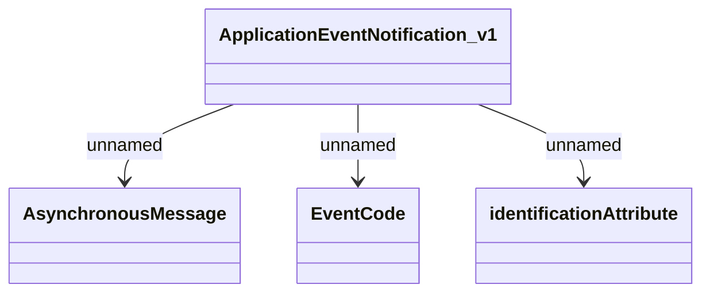

# ApplicationEventNotification_v1

```mermaid
classDiagram
    class identificationAttribute["identificationAttribute"]
    class EventCode["EventCode"]
    class AsynchronousMessage["AsynchronousMessage"]
    class ApplicationEventNotification_v1["ApplicationEventNotification_v1"]
    ApplicationEventNotification_v1 --> AsynchronousMessage : unnamed
    ApplicationEventNotification_v1 --> EventCode : unnamed
    ApplicationEventNotification_v1 --> identificationAttribute : unnamed
```
