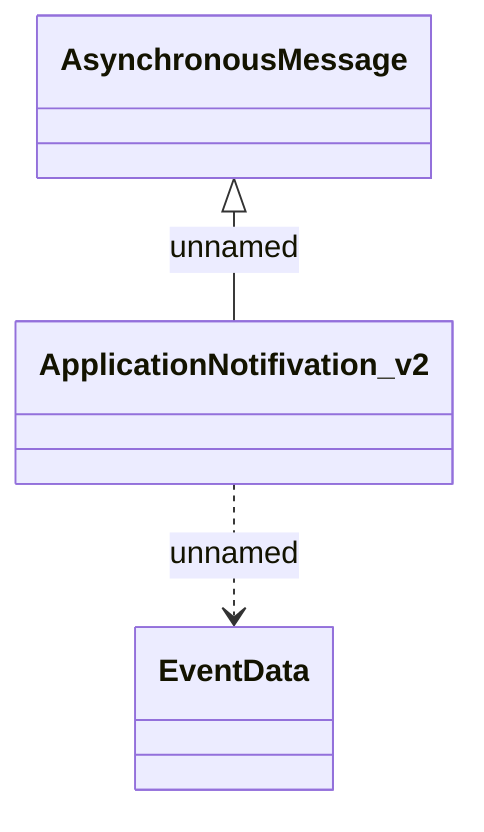

# ApplicationEventNotification_v2

- **Diagram Type**: Logical
- **Package**: HomerSelect/BSL/Analysis Model/_Interface/Provided notification messages/Asynchronous Message/Application Event/ApplicationEventNotification_v2
- **Diagram ID**: 136921
- **Elements**: 3
- **Connectors**: 2

