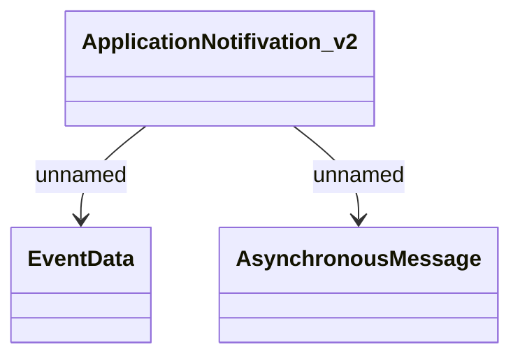

# ApplicationEventNotification_v2

```mermaid
classDiagram
    class AsynchronousMessage["AsynchronousMessage"]
    class EventData["EventData"]
    class ApplicationNotifivation_v2["ApplicationNotifivation_v2"]
    ApplicationNotifivation_v2 --> EventData : unnamed
    ApplicationNotifivation_v2 --> AsynchronousMessage : unnamed
```
