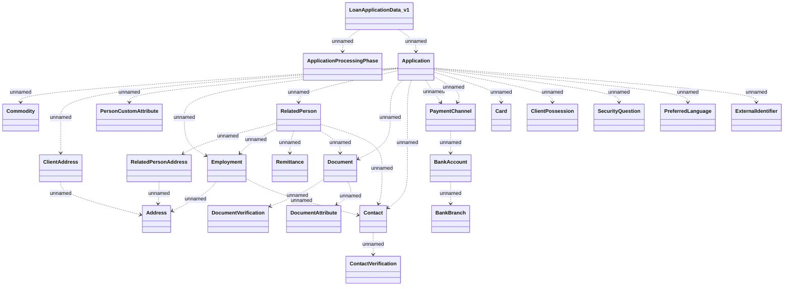

# LoanApplicationData_v1

- **Diagram Type**: Logical
- **Package**: HomerSelect/BSL/Analysis Model/_Interface/Provided notification messages/Asynchronous Message/LoanApplicationData/LoanApplicationData_v1
- **Diagram ID**: 150380
- **Elements**: 24
- **Connectors**: 30

