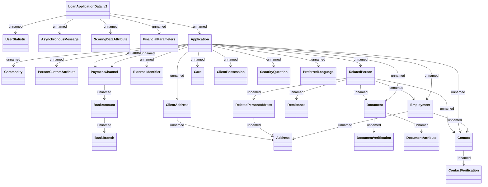

# LoanApplicationData_v2

```mermaid
classDiagram
    class UserStatistic["UserStatistic"]
    class AsynchronousMessage["AsynchronousMessage"]
    class ScoringDataAttribute["ScoringDataAttribute"]
    class FinancialParameters["FinancialParameters"]
    class BankBranch["BankBranch"]
    class Commodity["Commodity"]
    class ClientAddress["ClientAddress"]
    class RelatedPersonAddress["RelatedPersonAddress"]
    class Address["Address"]
    class PersonCustomAttribute["PersonCustomAttribute"]
    class Employment["Employment"]
    class Remittance["Remittance"]
    class RelatedPerson["RelatedPerson"]
    class ExternalIdentifier["ExternalIdentifier"]
    class DocumentVerification["DocumentVerification"]
    class ContactVerification["ContactVerification"]
    class DocumentAttribute["DocumentAttribute"]
    class Document["Document"]
    class Contact["Contact"]
    class BankAccount["BankAccount"]
    class PaymentChannel["PaymentChannel"]
    class Card["Card"]
    class ClientPossession["ClientPossession"]
    class SecurityQuestion["SecurityQuestion"]
    class PreferredLanguage["PreferredLanguage"]
    class Application["Application"]
    class LoanApplicationData_v2["LoanApplicationData_v2"]
    RelatedPerson --> RelatedPersonAddress : unnamed
    RelatedPerson --> Remittance : unnamed
    Application --> Employment : unnamed
    RelatedPerson --> Employment : unnamed
    Application --> PersonCustomAttribute : unnamed
    Employment --> Address : unnamed
    LoanApplicationData_v2 --> UserStatistic : unnamed
    RelatedPersonAddress --> Address : unnamed
    Document --> DocumentVerification : unnamed
    Application --> ClientAddress : unnamed
    Application --> Commodity : unnamed
    BankAccount --> BankBranch : unnamed
    LoanApplicationData_v2 --> FinancialParameters : unnamed
    LoanApplicationData_v2 --> ScoringDataAttribute : unnamed
    LoanApplicationData_v2 --> AsynchronousMessage : unnamed
    ClientAddress --> Address : unnamed
    Employment --> Contact : unnamed
    Application --> PreferredLanguage : unnamed
    Application --> SecurityQuestion : unnamed
    Application --> ClientPossession : unnamed
    Application --> Card : unnamed
    Application --> PaymentChannel : unnamed
    Application --> PaymentChannel : unnamed
    Application --> RelatedPerson : unnamed
    Application --> Contact : unnamed
    Application --> ExternalIdentifier : unnamed
    RelatedPerson --> Contact : unnamed
    Application --> Document : unnamed
    RelatedPerson --> Document : unnamed
    Document --> DocumentAttribute : unnamed
    Contact --> ContactVerification : unnamed
    LoanApplicationData_v2 --> Application : unnamed
    PaymentChannel --> BankAccount : unnamed
```
