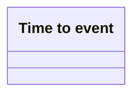

# Time to Event

- **Diagram Type**: Logical
- **Package**: HomerSelect/BSL/Analysis Model/_Interface/Provided notification messages/Asynchronous Message/Time to Event
- **Diagram ID**: 133053
- **Elements**: 1
- **Connectors**: 0

