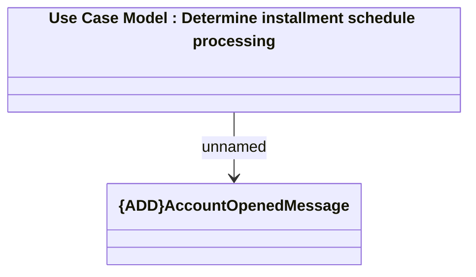

# Consumed JMS messages - Account Opened

- **Diagram Type**: Logical
- **Package**: HomerSelect/BSL/Analysis Model/_Interface/RabbitMQ messages/Consumed RabbitMQ messages/Account  Notifications (CEL)
- **Diagram ID**: 113029
- **Elements**: 2
- **Connectors**: 1

