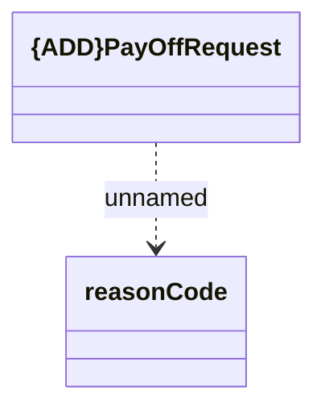

# PayOffRequest

- **Diagram Type**: Logical
- **Package**: HomerSelect/BSL/Analysis Model/_Interface/RabbitMQ messages/Consumed RabbitMQ messages/Contract Requests/v1/PayOffRequest
- **Diagram ID**: 159874
- **Elements**: 2
- **Connectors**: 1

