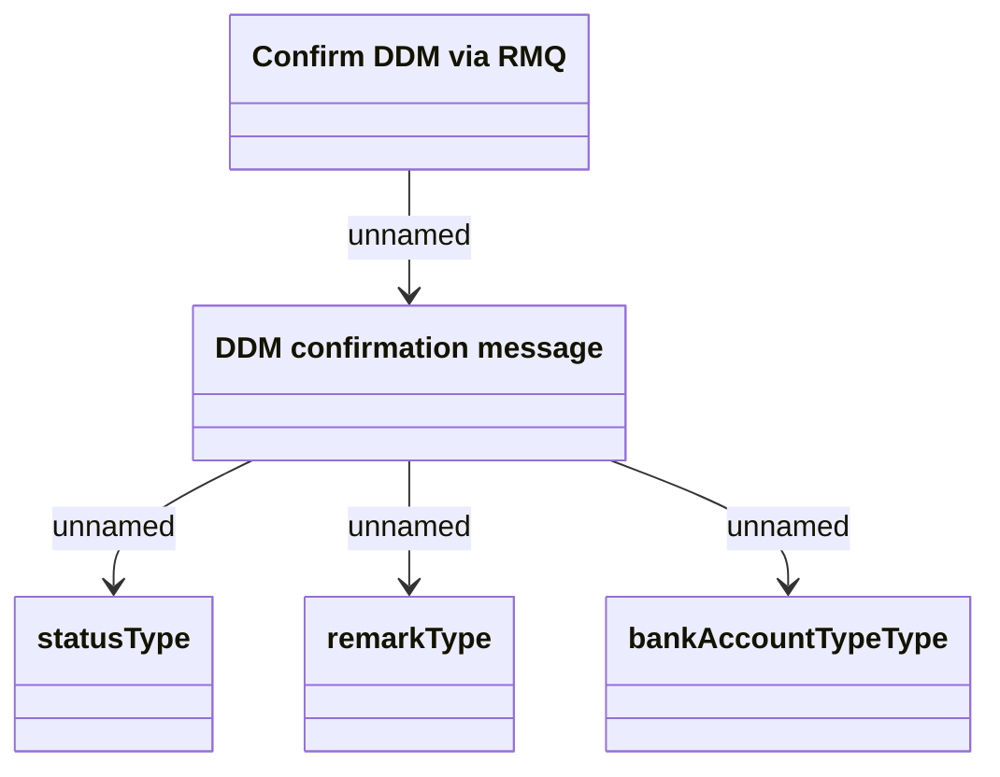

# DDM confirmation

```mermaid
classDiagram
    class statusType["statusType"]
    class remarkType["remarkType"]
    class bankAccountTypeType["bankAccountTypeType"]
    class Confirm_DDM_via_RMQ["Confirm DDM via RMQ"]
    class DDM_confirmation_message["DDM confirmation message"]
    DDM_confirmation_message --> statusType : unnamed
    DDM_confirmation_message --> remarkType : unnamed
    DDM_confirmation_message --> bankAccountTypeType : unnamed
    Confirm_DDM_via_RMQ --> DDM_confirmation_message : unnamed
```
