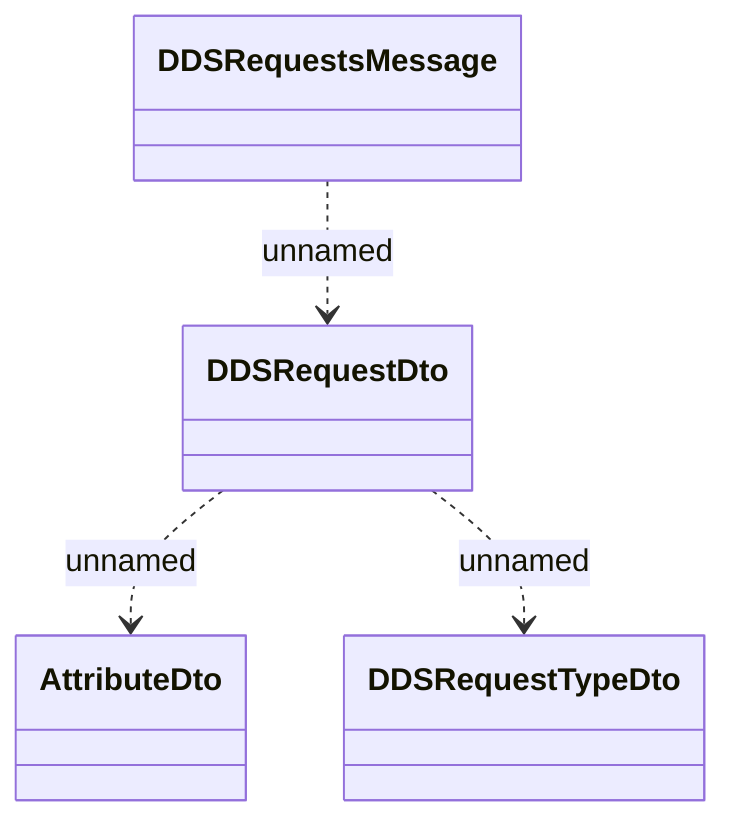

# Consumed JMS messages - DDS request

- **Diagram Type**: Logical
- **Package**: HomerSelect/BSL/Analysis Model/_Interface/RabbitMQ messages/Consumed RabbitMQ messages/Payments/DDS
- **Diagram ID**: 97288
- **Elements**: 4
- **Connectors**: 3

