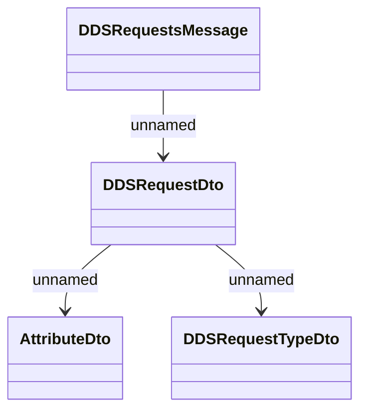

# Consumed JMS messages - DDS request

```mermaid
classDiagram
    class AttributeDto["AttributeDto"]
    class DDSRequestTypeDto["DDSRequestTypeDto"]
    class DDSRequestDto["DDSRequestDto"]
    class DDSRequestsMessage["DDSRequestsMessage"]
    DDSRequestsMessage --> DDSRequestDto : unnamed
    DDSRequestDto --> AttributeDto : unnamed
    DDSRequestDto --> DDSRequestTypeDto : unnamed
```
