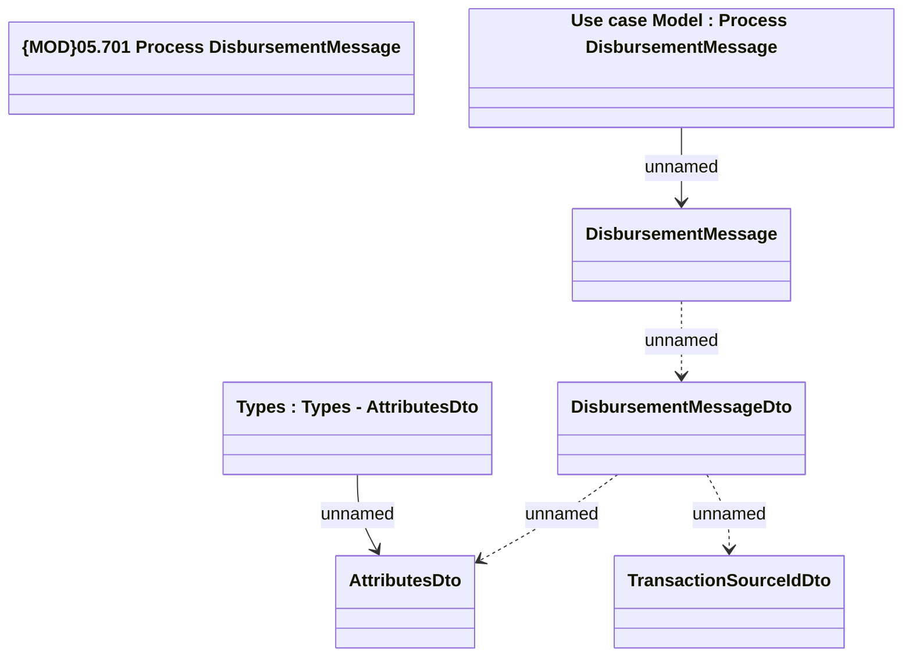

# Consumed JMS messages - DisbursementMessage

- **Diagram Type**: Logical
- **Package**: HomerSelect/BSL/Analysis Model/_Interface/RabbitMQ messages/Consumed RabbitMQ messages/Payments/DisbursementMessage
- **Diagram ID**: 92752
- **Elements**: 7
- **Connectors**: 5

