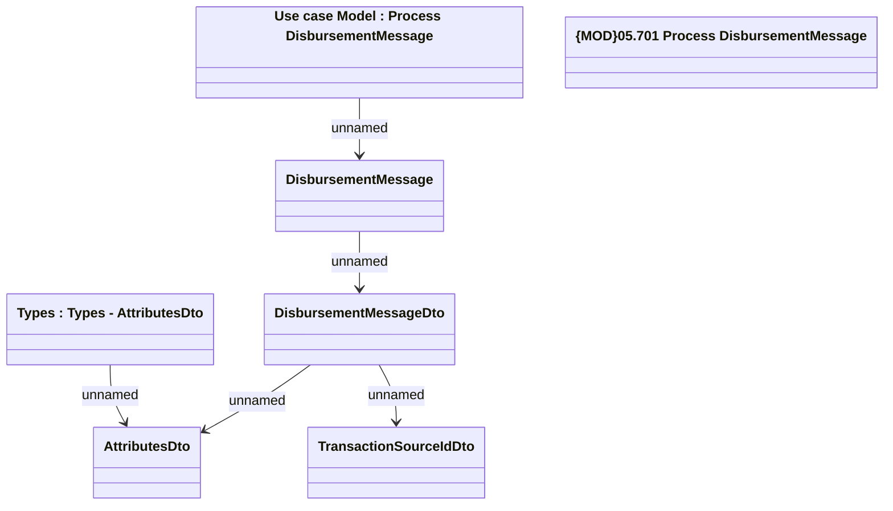

# Consumed JMS messages - DisbursementMessage

```mermaid
classDiagram
    class Use_case_Model_Process_DisbursementMessage["Use case Model : Process DisbursementMessage"]
    class Types_Types_AttributesDto["Types : Types - AttributesDto"]
    class AttributesDto["AttributesDto"]
    class TransactionSourceIdDto["TransactionSourceIdDto"]
    class DisbursementMessageDto["DisbursementMessageDto"]
    class DisbursementMessage["DisbursementMessage"]
    class MOD_05_701_Process_DisbursementMessage["{MOD}05.701 Process DisbursementMessage"]
    Types_Types_AttributesDto --> AttributesDto : unnamed
    Use_case_Model_Process_DisbursementMessage --> DisbursementMessage : unnamed
    DisbursementMessage --> DisbursementMessageDto : unnamed
    DisbursementMessageDto --> AttributesDto : unnamed
    DisbursementMessageDto --> TransactionSourceIdDto : unnamed
```
