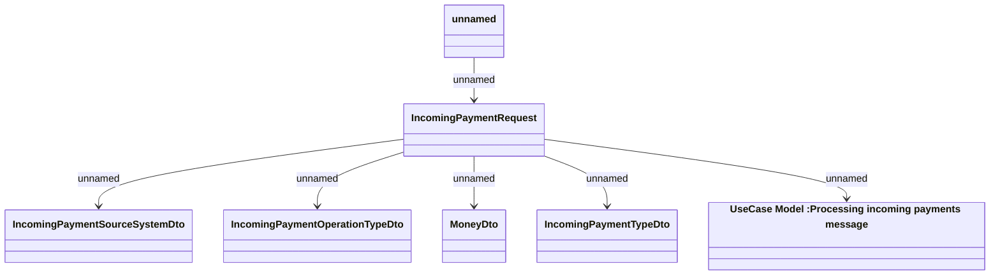

# Consumed JMS messages - Set incoming payment

```mermaid
classDiagram
    class IncomingPaymentSourceSystemDto["IncomingPaymentSourceSystemDto"]
    class IncomingPaymentOperationTypeDto["IncomingPaymentOperationTypeDto"]
    class UseCase_Model_Processing_incoming_payments_message["UseCase Model :Processing incoming payments message"]
    class IncomingPaymentTypeDto["IncomingPaymentTypeDto"]
    class MoneyDto["MoneyDto"]
    class IncomingPaymentRequest["IncomingPaymentRequest"]
    IncomingPaymentRequest --> IncomingPaymentSourceSystemDto : unnamed
    IncomingPaymentRequest --> IncomingPaymentOperationTypeDto : unnamed
    unnamed --> IncomingPaymentRequest : unnamed
    IncomingPaymentRequest --> MoneyDto : unnamed
    IncomingPaymentRequest --> IncomingPaymentTypeDto : unnamed
    IncomingPaymentRequest --> UseCase_Model_Processing_incoming_payments_message : unnamed
```
