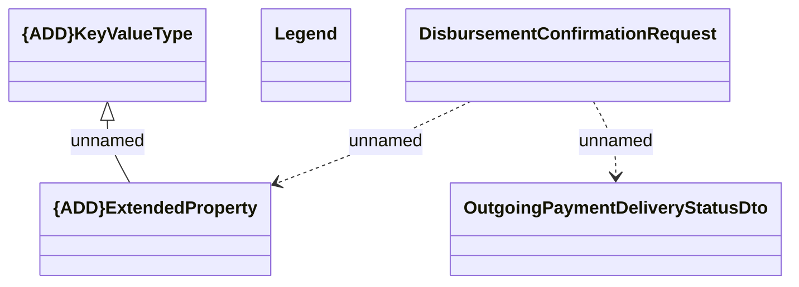

# Disbursement confirmation request

- **Diagram Type**: Logical
- **Package**: HomerSelect/BSL/Analysis Model/_Interface/RabbitMQ messages/Consumed RabbitMQ messages/Payments/OutgoingPayments
- **Diagram ID**: 163540
- **Elements**: 5
- **Connectors**: 3

