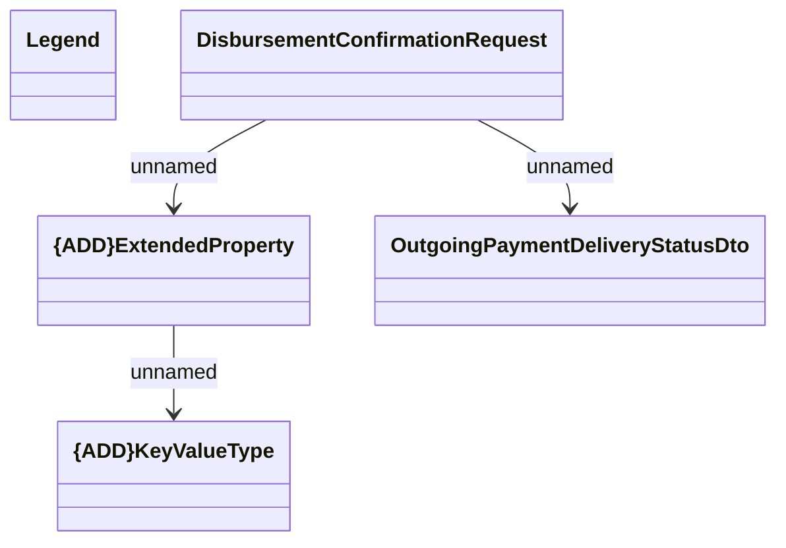

# Disbursement confirmation request

```mermaid
classDiagram
    class ADD_KeyValueType["{ADD}KeyValueType"]
    class ADD_ExtendedProperty["{ADD}ExtendedProperty"]
    class Legend["Legend"]
    class OutgoingPaymentDeliveryStatusDto["OutgoingPaymentDeliveryStatusDto"]
    class DisbursementConfirmationRequest["DisbursementConfirmationRequest"]
    ADD_ExtendedProperty --> ADD_KeyValueType : unnamed
    DisbursementConfirmationRequest --> ADD_ExtendedProperty : unnamed
    DisbursementConfirmationRequest --> OutgoingPaymentDeliveryStatusDto : unnamed
```
