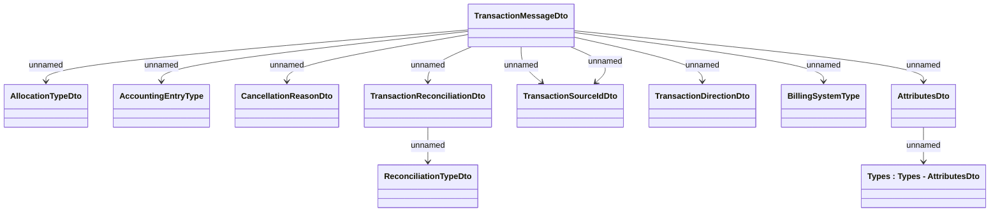

# Consumed JMS messages - REL Account transactions

```mermaid
classDiagram
    class Types_Types_AttributesDto["Types : Types - AttributesDto"]
    class AllocationTypeDto["AllocationTypeDto"]
    class AccountingEntryType["AccountingEntryType"]
    class CancellationReasonDto["CancellationReasonDto"]
    class AttributesDto["AttributesDto"]
    class ReconciliationTypeDto["ReconciliationTypeDto"]
    class TransactionSourceIdDto["TransactionSourceIdDto"]
    class TransactionDirectionDto["TransactionDirectionDto"]
    class BillingSystemType["BillingSystemType"]
    class TransactionReconciliationDto["TransactionReconciliationDto"]
    class TransactionMessageDto["TransactionMessageDto"]
    TransactionMessageDto --> CancellationReasonDto : unnamed
    TransactionMessageDto --> TransactionReconciliationDto : unnamed
    TransactionMessageDto --> TransactionSourceIdDto : unnamed
    TransactionMessageDto --> AllocationTypeDto : unnamed
    TransactionMessageDto --> TransactionSourceIdDto : unnamed
    TransactionMessageDto --> BillingSystemType : unnamed
    TransactionMessageDto --> AccountingEntryType : unnamed
    TransactionMessageDto --> AttributesDto : unnamed
    TransactionMessageDto --> TransactionDirectionDto : unnamed
    TransactionReconciliationDto --> ReconciliationTypeDto : unnamed
    AttributesDto --> Types_Types_AttributesDto : unnamed
```
