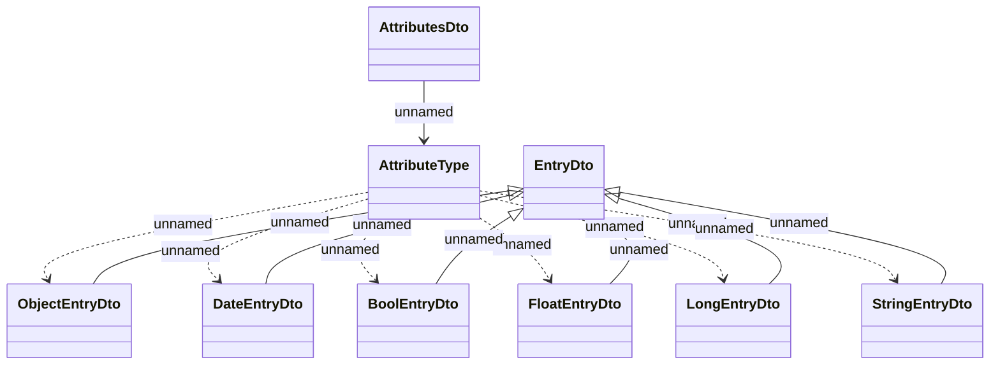

# Types - AttributesDto

- **Diagram Type**: Logical
- **Package**: HomerSelect/BSL/Analysis Model/_Interface/RabbitMQ messages/Consumed RabbitMQ messages/Payments/REL Account transactions/Types
- **Diagram ID**: 87801
- **Elements**: 9
- **Connectors**: 13

