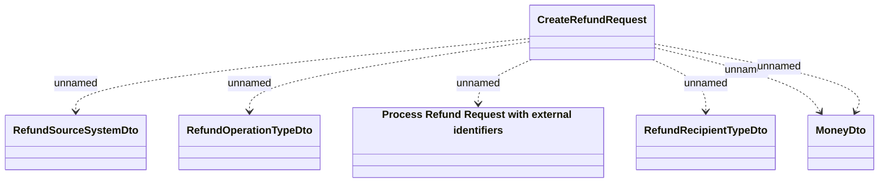

# Create Refund Request

- **Diagram Type**: Logical
- **Package**: HomerSelect/BSL/Analysis Model/_Interface/RabbitMQ messages/Consumed RabbitMQ messages/Payments/Refunds
- **Diagram ID**: 164590
- **Elements**: 6
- **Connectors**: 6

