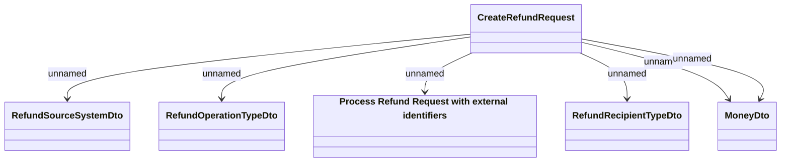

# Create Refund Request

```mermaid
classDiagram
    class MoneyDto["MoneyDto"]
    class RefundOperationTypeDto["RefundOperationTypeDto"]
    class CreateRefundRequest["CreateRefundRequest"]
    class Process_Refund_Request_with_external_identifiers["Process Refund Request with external identifiers"]
    class RefundRecipientTypeDto["RefundRecipientTypeDto"]
    class RefundSourceSystemDto["RefundSourceSystemDto"]
    CreateRefundRequest --> RefundSourceSystemDto : unnamed
    CreateRefundRequest --> RefundOperationTypeDto : unnamed
    CreateRefundRequest --> Process_Refund_Request_with_external_identifiers : unnamed
    CreateRefundRequest --> RefundRecipientTypeDto : unnamed
    CreateRefundRequest --> MoneyDto : unnamed
    CreateRefundRequest --> MoneyDto : unnamed
```
