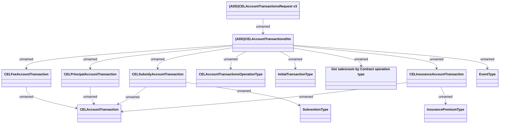

# CELAccountTransactionsRequest

```mermaid
classDiagram
    class EventType["EventType"]
    class ADD_CELAccountTransactionsRequest_v3["{ADD}CELAccountTransactionsRequest v3"]
    class ADD_CELAccountTransactionsDto["{ADD}CELAccountTransactionsDto"]
    class CELInsuranceAccountTransaction["CELInsuranceAccountTransaction"]
    class Get_salesroom_by_Contract_operation_type["Get salesroom by Contract operation type"]
    class InitialTransactionType["InitialTransactionType"]
    class SubventionType["SubventionType"]
    class InsurancePremiumType["InsurancePremiumType"]
    class CELAccountTransactionsOperationType["CELAccountTransactionsOperationType"]
    class CELSubsidyAccountTransaction["CELSubsidyAccountTransaction"]
    class CELPrincipalAccountTransaction["CELPrincipalAccountTransaction"]
    class CELFeeAccountTransaction["CELFeeAccountTransaction"]
    class CELAccountTransaction["CELAccountTransaction"]
    CELInsuranceAccountTransaction --> CELAccountTransaction : unnamed
    CELSubsidyAccountTransaction --> CELAccountTransaction : unnamed
    CELPrincipalAccountTransaction --> CELAccountTransaction : unnamed
    CELFeeAccountTransaction --> CELAccountTransaction : unnamed
    ADD_CELAccountTransactionsDto --> CELFeeAccountTransaction : unnamed
    ADD_CELAccountTransactionsDto --> CELPrincipalAccountTransaction : unnamed
    ADD_CELAccountTransactionsDto --> CELSubsidyAccountTransaction : unnamed
    ADD_CELAccountTransactionsDto --> CELAccountTransactionsOperationType : unnamed
    CELInsuranceAccountTransaction --> InsurancePremiumType : unnamed
    CELSubsidyAccountTransaction --> SubventionType : unnamed
    ADD_CELAccountTransactionsDto --> InitialTransactionType : unnamed
    ADD_CELAccountTransactionsDto --> Get_salesroom_by_Contract_operation_type : unnamed
    ADD_CELAccountTransactionsDto --> CELInsuranceAccountTransaction : unnamed
    ADD_CELAccountTransactionsRequest_v3 --> ADD_CELAccountTransactionsDto : unnamed
    ADD_CELAccountTransactionsDto --> EventType : unnamed
```
