# Application Notification

- **Diagram Type**: Logical
- **Package**: HomerSelect/BSL/Analysis Model/_Interface/RabbitMQ messages/Generated RabbitMQ messages/Application/Application Notification
- **Diagram ID**: 158220
- **Elements**: 20
- **Connectors**: 19

```mermaid
classDiagram
    class Application_Notification_ApplicationFailureNotification_Comm["Application Notification : ApplicationFailureNotification - Common"]
    class ApplicationFailureNotification["ApplicationFailureNotification"]
    class ApplicationSigningFailedNotification["ApplicationSigningFailedNotification"]
    class ApplicationDocumentationPreparationFailedNotification["ApplicationDocumentationPreparationFailedNotification"]
    class ClientUpdatedOnApplication["ClientUpdatedOnApplication"]
    class LoanSummaryNotification["LoanSummaryNotification"]
    class ApprovedApplicationUpdatedNotification["ApprovedApplicationUpdatedNotification"]
    class OfferSelectedNotification["OfferSelectedNotification"]
    class ApplicationDocumentationPreparedNotification["ApplicationDocumentationPreparedNotification"]
    class ApplicationSignedNotification["ApplicationSignedNotification"]
    class ApplicationPreApprovedNotification["ApplicationPreApprovedNotification"]
    class ApplicationDeduplicationNotification["ApplicationDeduplicationNotification"]
    class ApplicationApprovedNotification["ApplicationApprovedNotification"]
    class ApplicationCancelledNotification["ApplicationCancelledNotification"]
    class ApplicationRejectedNotification["ApplicationRejectedNotification"]
    class OfferRejectedWithAlternativeNotification["OfferRejectedWithAlternativeNotification"]
    class ApplicationEvaluationFailedNotification["ApplicationEvaluationFailedNotification"]
    class OfferApprovedWithAlternativeNotification["OfferApprovedWithAlternativeNotification"]
    class ApplicationEvaluationNotification["ApplicationEvaluationNotification"]
    class ApplicationNotification["ApplicationNotification"]
    ApplicationEvaluationNotification <|-- ApplicationPreApprovedNotification : unnamed
    ApplicationNotification <|-- ApplicationFailureNotification : {ADD LOR-7371/}
    ApplicationFailureNotification <|-- ApplicationSigningFailedNotification : unnamed
    ApplicationFailureNotification <|-- ApplicationDocumentationPreparationFailedNotification : unnamed
    ApplicationNotification <|-- ClientUpdatedOnApplication : unnamed
    ApplicationNotification <|-- LoanSummaryNotification : unnamed
    ApplicationNotification <|-- ApprovedApplicationUpdatedNotification : unnamed
    ApplicationNotification <|-- OfferSelectedNotification : unnamed
    Application_Notification_ApplicationFailureNotification_Comm --> ApplicationFailureNotification : unnamed
    ApplicationNotification <|-- ApplicationSignedNotification : unnamed
    ApplicationNotification <|-- ApplicationEvaluationNotification : unnamed
    ApplicationEvaluationNotification <|-- ApplicationDeduplicationNotification : unnamed
    ApplicationEvaluationNotification <|-- ApplicationApprovedNotification : unnamed
    ApplicationEvaluationNotification <|-- ApplicationCancelledNotification : unnamed
    ApplicationEvaluationNotification <|-- ApplicationRejectedNotification : unnamed
    ApplicationEvaluationNotification <|-- OfferRejectedWithAlternativeNotification : unnamed
    ApplicationEvaluationNotification <|-- ApplicationEvaluationFailedNotification : unnamed
    ApplicationEvaluationNotification <|-- OfferApprovedWithAlternativeNotification : unnamed
    ApplicationNotification <|-- ApplicationDocumentationPreparedNotification : unnamed
```

