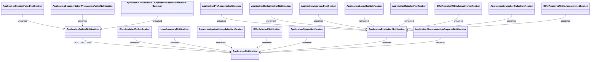

# Application Notification

```mermaid
classDiagram
    class Application_Notification_ApplicationFailureNotification_Comm["Application Notification : ApplicationFailureNotification - Common"]
    class ApplicationFailureNotification["ApplicationFailureNotification"]
    class ApplicationSigningFailedNotification["ApplicationSigningFailedNotification"]
    class ApplicationDocumentationPreparationFailedNotification["ApplicationDocumentationPreparationFailedNotification"]
    class ClientUpdatedOnApplication["ClientUpdatedOnApplication"]
    class LoanSummaryNotification["LoanSummaryNotification"]
    class ApprovedApplicationUpdatedNotification["ApprovedApplicationUpdatedNotification"]
    class OfferSelectedNotification["OfferSelectedNotification"]
    class ApplicationDocumentationPreparedNotification["ApplicationDocumentationPreparedNotification"]
    class ApplicationSignedNotification["ApplicationSignedNotification"]
    class ApplicationPreApprovedNotification["ApplicationPreApprovedNotification"]
    class ApplicationDeduplicationNotification["ApplicationDeduplicationNotification"]
    class ApplicationApprovedNotification["ApplicationApprovedNotification"]
    class ApplicationCancelledNotification["ApplicationCancelledNotification"]
    class ApplicationRejectedNotification["ApplicationRejectedNotification"]
    class OfferRejectedWithAlternativeNotification["OfferRejectedWithAlternativeNotification"]
    class ApplicationEvaluationFailedNotification["ApplicationEvaluationFailedNotification"]
    class OfferApprovedWithAlternativeNotification["OfferApprovedWithAlternativeNotification"]
    class ApplicationEvaluationNotification["ApplicationEvaluationNotification"]
    class ApplicationNotification["ApplicationNotification"]
    ApplicationPreApprovedNotification --> ApplicationEvaluationNotification : unnamed
    ApplicationFailureNotification --> ApplicationNotification : {ADD LOR-7371/}
    ApplicationSigningFailedNotification --> ApplicationFailureNotification : unnamed
    ApplicationDocumentationPreparationFailedNotification --> ApplicationFailureNotification : unnamed
    ClientUpdatedOnApplication --> ApplicationNotification : unnamed
    LoanSummaryNotification --> ApplicationNotification : unnamed
    ApprovedApplicationUpdatedNotification --> ApplicationNotification : unnamed
    OfferSelectedNotification --> ApplicationNotification : unnamed
    Application_Notification_ApplicationFailureNotification_Comm --> ApplicationFailureNotification : unnamed
    ApplicationSignedNotification --> ApplicationNotification : unnamed
    ApplicationEvaluationNotification --> ApplicationNotification : unnamed
    ApplicationDeduplicationNotification --> ApplicationEvaluationNotification : unnamed
    ApplicationApprovedNotification --> ApplicationEvaluationNotification : unnamed
    ApplicationCancelledNotification --> ApplicationEvaluationNotification : unnamed
    ApplicationRejectedNotification --> ApplicationEvaluationNotification : unnamed
    OfferRejectedWithAlternativeNotification --> ApplicationEvaluationNotification : unnamed
    ApplicationEvaluationFailedNotification --> ApplicationEvaluationNotification : unnamed
    OfferApprovedWithAlternativeNotification --> ApplicationEvaluationNotification : unnamed
    ApplicationDocumentationPreparedNotification --> ApplicationNotification : unnamed
```
