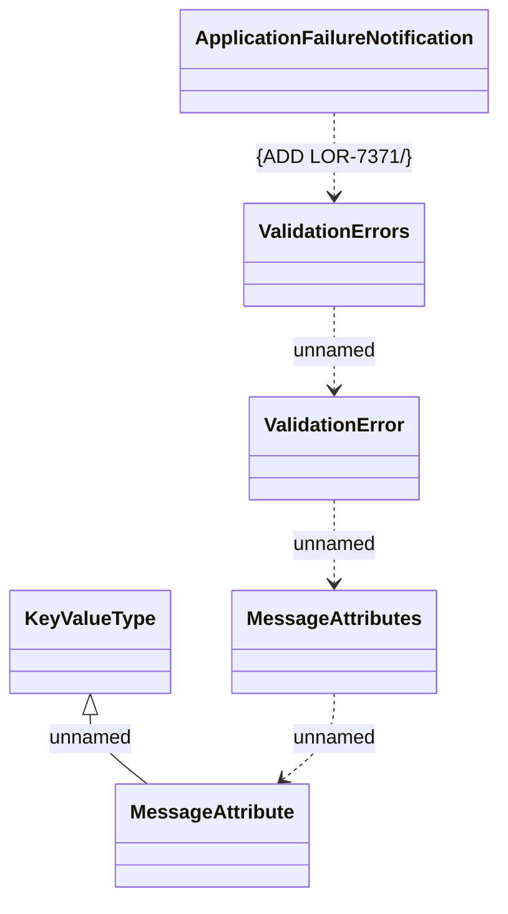

# ApplicationFailureNotification - Common

- **Diagram Type**: Logical
- **Package**: HomerSelect/BSL/Analysis Model/_Interface/RabbitMQ messages/Generated RabbitMQ messages/Application/Application Notification
- **Diagram ID**: 158221
- **Elements**: 7
- **Connectors**: 5

