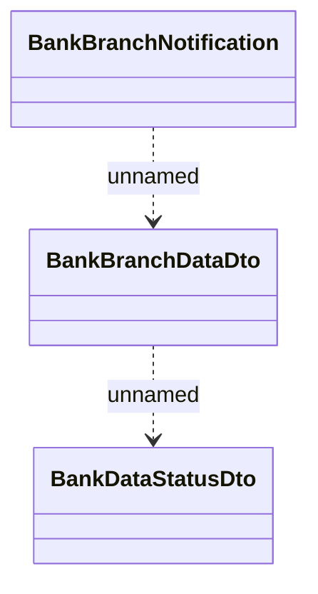

# BankBranchNotification

- **Diagram Type**: Logical
- **Package**: HomerSelect/BSL/Analysis Model/_Interface/RabbitMQ messages/Generated RabbitMQ messages/Bank management/BankBranchDataNotification
- **Diagram ID**: 106651
- **Elements**: 3
- **Connectors**: 2

