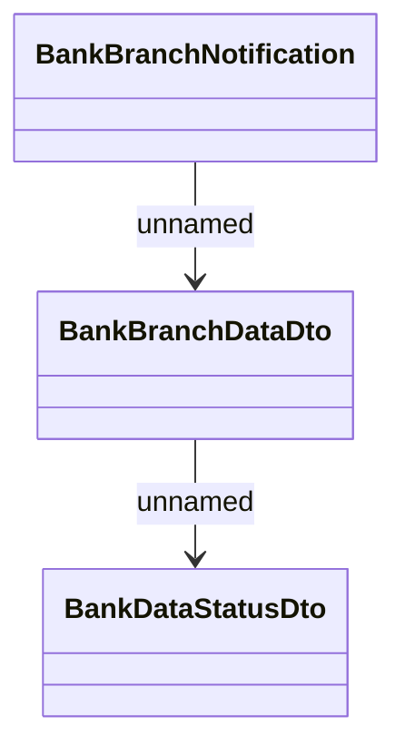

# BankBranchNotification

```mermaid
classDiagram
    class BankDataStatusDto["BankDataStatusDto"]
    class BankBranchDataDto["BankBranchDataDto"]
    class BankBranchNotification["BankBranchNotification"]
    BankBranchDataDto --> BankDataStatusDto : unnamed
    BankBranchNotification --> BankBranchDataDto : unnamed
```
