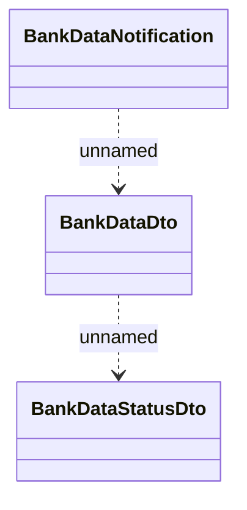

# BankNotification

- **Diagram Type**: Logical
- **Package**: HomerSelect/BSL/Analysis Model/_Interface/RabbitMQ messages/Generated RabbitMQ messages/Bank management/BankDataNotification
- **Diagram ID**: 107993
- **Elements**: 3
- **Connectors**: 2

