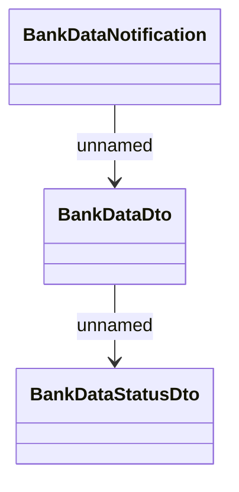

# BankNotification

```mermaid
classDiagram
    class BankDataStatusDto["BankDataStatusDto"]
    class BankDataDto["BankDataDto"]
    class BankDataNotification["BankDataNotification"]
    BankDataNotification --> BankDataDto : unnamed
    BankDataDto --> BankDataStatusDto : unnamed
```
