# Contract Service notification

- **Diagram Type**: Logical
- **Package**: HomerSelect/BSL/Analysis Model/_Interface/RabbitMQ messages/Generated RabbitMQ messages/Contract Service notification
- **Diagram ID**: 164566
- **Elements**: 13
- **Connectors**: 12

```mermaid
classDiagram
    class External_Reference["External Reference"]
    class OperationStatusType["OperationStatusType"]
    class RelatedTransaction["RelatedTransaction"]
    class ContractInsuranceServiceCreatedNotification["ContractInsuranceServiceCreatedNotification "]
    class ContractServiceReplacedNotification["ContractServiceReplacedNotification"]
    class ContractInsuranceServiceNotification["ContractInsuranceServiceNotification"]
    class ContractServiceCanceledNotification["ContractServiceCanceledNotification"]
    class ContractInsuranceServiceCanceledNotification["ContractInsuranceServiceCanceledNotification"]
    class ContractServiceTerminatedNotification["ContractServiceTerminatedNotification"]
    class ContractInsuranceServiceTerminatedNotification["ContractInsuranceServiceTerminatedNotification"]
    class ContractServiceActivatedNotification["ContractServiceActivatedNotification"]
    class ContractInsuranceServiceActivatedNotification["ContractInsuranceServiceActivatedNotification"]
    class ContractServiceNotification["ContractServiceNotification"]
    ContractServiceNotification ..> RelatedTransaction : unnamed
    ContractServiceNotification ..> OperationStatusType : unnamed
    ContractInsuranceServiceNotification <|-- ContractInsuranceServiceActivatedNotification : unnamed
    ContractServiceNotification <|-- ContractServiceActivatedNotification : unnamed
    ContractInsuranceServiceNotification <|-- ContractInsuranceServiceTerminatedNotification : unnamed
    ContractServiceNotification <|-- ContractServiceTerminatedNotification : unnamed
    ContractInsuranceServiceNotification <|-- ContractInsuranceServiceCanceledNotification : unnamed
    ContractServiceNotification <|-- ContractServiceCanceledNotification : unnamed
    ContractServiceNotification <|-- ContractInsuranceServiceNotification : unnamed
    ContractServiceNotification <|-- ContractServiceReplacedNotification : unnamed
    ContractInsuranceServiceNotification <|-- ContractInsuranceServiceCreatedNotification : unnamed
```

