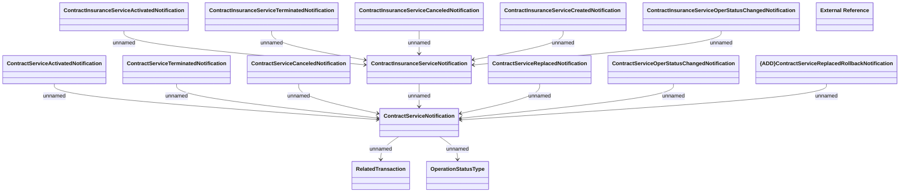

# Contract Service Notification v5

```mermaid
classDiagram
    class ADD_ContractServiceReplacedRollbackNotification["{ADD}ContractServiceReplacedRollbackNotification "]
    class OperationStatusType["OperationStatusType"]
    class ContractInsuranceServiceOperStatusChangedNotification["ContractInsuranceServiceOperStatusChangedNotification"]
    class ContractServiceOperStatusChangedNotification["ContractServiceOperStatusChangedNotification"]
    class RelatedTransaction["RelatedTransaction"]
    class ContractInsuranceServiceCreatedNotification["ContractInsuranceServiceCreatedNotification "]
    class ContractServiceReplacedNotification["ContractServiceReplacedNotification"]
    class ContractInsuranceServiceNotification["ContractInsuranceServiceNotification"]
    class ContractServiceCanceledNotification["ContractServiceCanceledNotification"]
    class ContractInsuranceServiceCanceledNotification["ContractInsuranceServiceCanceledNotification"]
    class ContractServiceTerminatedNotification["ContractServiceTerminatedNotification"]
    class ContractInsuranceServiceTerminatedNotification["ContractInsuranceServiceTerminatedNotification"]
    class ContractServiceActivatedNotification["ContractServiceActivatedNotification"]
    class ContractInsuranceServiceActivatedNotification["ContractInsuranceServiceActivatedNotification"]
    class ContractServiceNotification["ContractServiceNotification"]
    class External_Reference["External Reference"]
    ContractServiceNotification --> RelatedTransaction : unnamed
    ContractServiceNotification --> OperationStatusType : unnamed
    ContractInsuranceServiceActivatedNotification --> ContractInsuranceServiceNotification : unnamed
    ContractServiceActivatedNotification --> ContractServiceNotification : unnamed
    ContractInsuranceServiceTerminatedNotification --> ContractInsuranceServiceNotification : unnamed
    ContractServiceTerminatedNotification --> ContractServiceNotification : unnamed
    ContractInsuranceServiceCanceledNotification --> ContractInsuranceServiceNotification : unnamed
    ContractServiceCanceledNotification --> ContractServiceNotification : unnamed
    ContractInsuranceServiceNotification --> ContractServiceNotification : unnamed
    ContractServiceReplacedNotification --> ContractServiceNotification : unnamed
    ContractInsuranceServiceCreatedNotification --> ContractInsuranceServiceNotification : unnamed
    ContractServiceOperStatusChangedNotification --> ContractServiceNotification : unnamed
    ContractInsuranceServiceOperStatusChangedNotification --> ContractInsuranceServiceNotification : unnamed
    ADD_ContractServiceReplacedRollbackNotification --> ContractServiceNotification : unnamed
```
