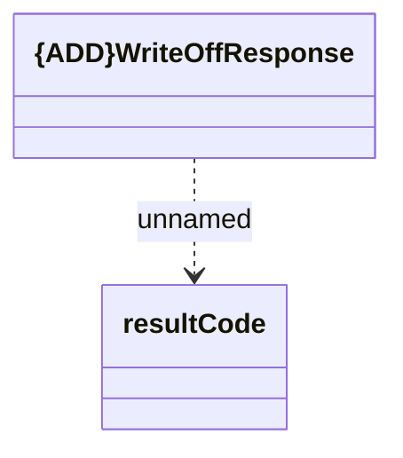

# WriteOffResponse

- **Diagram Type**: Logical
- **Package**: HomerSelect/BSL/Analysis Model/_Interface/RabbitMQ messages/Generated RabbitMQ messages/Contract Transition Responses/v1/WriteOffResponse
- **Diagram ID**: 145996
- **Elements**: 2
- **Connectors**: 1

