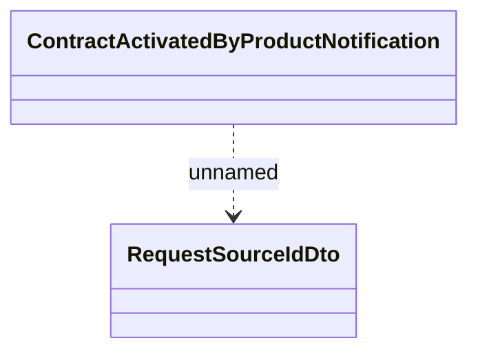

# Client notifications about Contract registration

- **Diagram Type**: Logical
- **Package**: HomerSelect/BSL/Analysis Model/_Interface/RabbitMQ messages/Generated RabbitMQ messages/Contract/Client notifications about Contract events
- **Diagram ID**: 106584
- **Elements**: 2
- **Connectors**: 1

