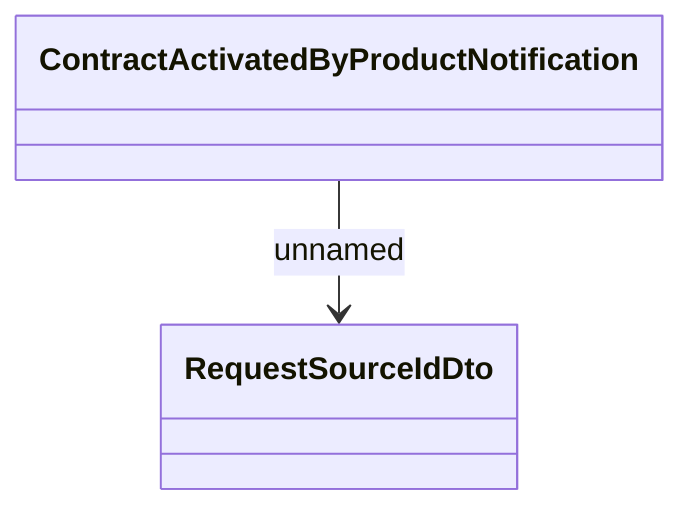

# Client notifications about Contract registration

```mermaid
classDiagram
    class RequestSourceIdDto["RequestSourceIdDto"]
    class ContractActivatedByProductNotification["ContractActivatedByProductNotification"]
    ContractActivatedByProductNotification --> RequestSourceIdDto : unnamed
```
