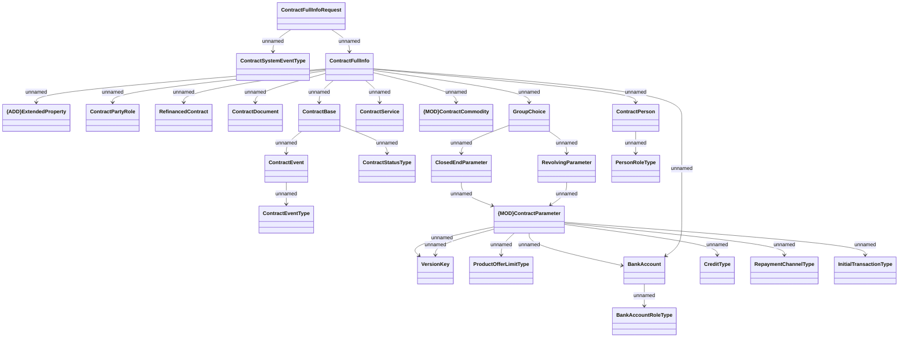

# ContractFullInfo notification v8 (PH only)

```mermaid
classDiagram
    class ADD_ExtendedProperty["{ADD}ExtendedProperty"]
    class ContractSystemEventType["ContractSystemEventType"]
    class ContractEventType["ContractEventType"]
    class VersionKey["VersionKey"]
    class ContractPartyRole["ContractPartyRole"]
    class RefinancedContract["RefinancedContract"]
    class ContractDocument["ContractDocument"]
    class ProductOfferLimitType["ProductOfferLimitType"]
    class BankAccountRoleType["BankAccountRoleType"]
    class GroupChoice["GroupChoice"]
    class ContractFullInfoRequest["ContractFullInfoRequest"]
    class ContractService["ContractService"]
    class ContractEvent["ContractEvent"]
    class BankAccount["BankAccount"]
    class CreditType["CreditType"]
    class ContractFullInfo["ContractFullInfo"]
    class ContractStatusType["ContractStatusType"]
    class RepaymentChannelType["RepaymentChannelType"]
    class MOD_ContractCommodity["{MOD}ContractCommodity"]
    class InitialTransactionType["InitialTransactionType"]
    class RevolvingParameter["RevolvingParameter"]
    class ClosedEndParameter["ClosedEndParameter"]
    class MOD_ContractParameter["{MOD}ContractParameter"]
    class PersonRoleType["PersonRoleType"]
    class ContractPerson["ContractPerson"]
    class ContractBase["ContractBase"]
    MOD_ContractParameter --> BankAccount : unnamed
    ContractFullInfoRequest --> ContractSystemEventType : unnamed
    ContractEvent --> ContractEventType : unnamed
    MOD_ContractParameter --> VersionKey : unnamed
    MOD_ContractParameter --> VersionKey : unnamed
    ContractFullInfo --> ContractPartyRole : unnamed
    ContractFullInfo --> RefinancedContract : unnamed
    ContractFullInfo --> ContractDocument : unnamed
    MOD_ContractParameter --> ProductOfferLimitType : unnamed
    BankAccount --> BankAccountRoleType : unnamed
    ContractFullInfo --> GroupChoice : unnamed
    ContractFullInfo --> ContractService : unnamed
    ContractFullInfo --> ADD_ExtendedProperty : unnamed
    ContractFullInfo --> BankAccount : unnamed
    ContractFullInfo --> ContractBase : unnamed
    MOD_ContractParameter --> CreditType : unnamed
    ContractFullInfoRequest --> ContractFullInfo : unnamed
    ContractBase --> ContractStatusType : unnamed
    MOD_ContractParameter --> RepaymentChannelType : unnamed
    ContractFullInfo --> MOD_ContractCommodity : unnamed
    MOD_ContractParameter --> InitialTransactionType : unnamed
    GroupChoice --> RevolvingParameter : unnamed
    GroupChoice --> ClosedEndParameter : unnamed
    ClosedEndParameter --> MOD_ContractParameter : unnamed
    RevolvingParameter --> MOD_ContractParameter : unnamed
    ContractPerson --> PersonRoleType : unnamed
    ContractFullInfo --> ContractPerson : unnamed
    ContractBase --> ContractEvent : unnamed
```
