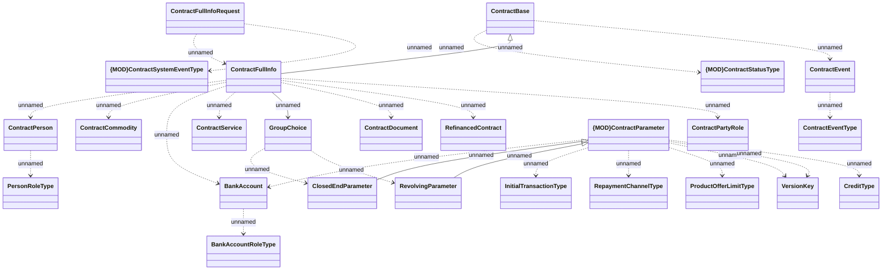

# v8 - IN only

- **Diagram Type**: Logical
- **Package**: HomerSelect/BSL/Analysis Model/_Interface/RabbitMQ messages/Generated RabbitMQ messages/Contract/Contract Event/ContractFullInfo v8 - IN only
- **Diagram ID**: 164686
- **Elements**: 25
- **Connectors**: 27

