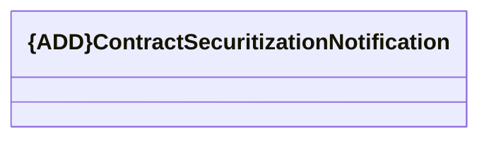

# ContractSecuritizationNotification

- **Diagram Type**: Logical
- **Package**: HomerSelect/BSL/Analysis Model/_Interface/RabbitMQ messages/Generated RabbitMQ messages/Contract/Contract Event/v1/ContractSecuritizationNotification
- **Diagram ID**: 157866
- **Elements**: 1
- **Connectors**: 0

