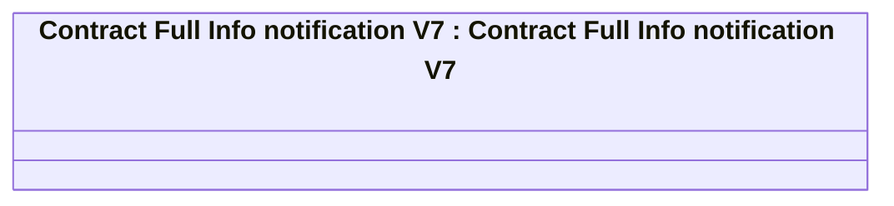

# Contract Full Info bulk notification

- **Diagram Type**: Logical
- **Package**: HomerSelect/BSL/Analysis Model/_Interface/RabbitMQ messages/Generated RabbitMQ messages/Contract/Contract Event/v7/Contract Full Info bulk notification
- **Diagram ID**: 145355
- **Elements**: 1
- **Connectors**: 0

