# ContractFullInfo notification

- **Diagram Type**: Logical
- **Package**: HomerSelect/BSL/Analysis Model/_Interface/RabbitMQ messages/Generated RabbitMQ messages/Contract/Contract Event/v7/ContractFullInfo notification
- **Diagram ID**: 164545
- **Elements**: 25
- **Connectors**: 27

```mermaid
classDiagram
    class ContractSystemEventType["ContractSystemEventType"]
    class ContractEventType["ContractEventType"]
    class VersionKey["VersionKey"]
    class ContractPartyRole["ContractPartyRole"]
    class RefinancedContract["RefinancedContract"]
    class ContractDocument["ContractDocument"]
    class ProductOfferLimitType["ProductOfferLimitType"]
    class BankAccountRoleType["BankAccountRoleType"]
    class GroupChoice["GroupChoice"]
    class ContractFullInfoRequest["ContractFullInfoRequest"]
    class ContractService["ContractService"]
    class ContractEvent["ContractEvent"]
    class BankAccount["BankAccount"]
    class CreditType["CreditType"]
    class ContractFullInfo["ContractFullInfo"]
    class ContractStatusType["ContractStatusType"]
    class RepaymentChannelType["RepaymentChannelType"]
    class ContractCommodity["ContractCommodity"]
    class InitialTransactionType["InitialTransactionType"]
    class RevolvingParameter["RevolvingParameter"]
    class ClosedEndParameter["ClosedEndParameter"]
    class MOD_ContractParameter["{MOD}ContractParameter"]
    class PersonRoleType["PersonRoleType"]
    class ContractPerson["ContractPerson"]
    class ContractBase["ContractBase"]
    MOD_ContractParameter ..> CreditType : unnamed
    ContractEvent ..> ContractEventType : unnamed
    MOD_ContractParameter ..> VersionKey : unnamed
    MOD_ContractParameter ..> VersionKey : unnamed
    ContractFullInfo ..> ContractPartyRole : unnamed
    ContractFullInfo ..> RefinancedContract : unnamed
    ContractFullInfo ..> ContractDocument : unnamed
    MOD_ContractParameter ..> ProductOfferLimitType : unnamed
    BankAccount ..> BankAccountRoleType : unnamed
    ContractFullInfo --> GroupChoice : unnamed
    ContractFullInfo ..> ContractService : unnamed
    ContractBase ..> ContractEvent : unnamed
    ContractFullInfoRequest ..> ContractSystemEventType : unnamed
    MOD_ContractParameter ..> BankAccount : unnamed
    ContractBase <|-- ContractFullInfo : unnamed
    ContractFullInfoRequest ..> ContractFullInfo : unnamed
    ContractBase ..> ContractStatusType : unnamed
    MOD_ContractParameter ..> RepaymentChannelType : unnamed
    ContractFullInfo ..> ContractCommodity : unnamed
    MOD_ContractParameter ..> InitialTransactionType : unnamed
    GroupChoice ..> RevolvingParameter : unnamed
    GroupChoice ..> ClosedEndParameter : unnamed
    MOD_ContractParameter <|-- RevolvingParameter : unnamed
    MOD_ContractParameter <|-- ClosedEndParameter : unnamed
    ContractPerson ..> PersonRoleType : unnamed
    ContractFullInfo ..> ContractPerson : unnamed
    ContractFullInfo ..> BankAccount : unnamed
```

