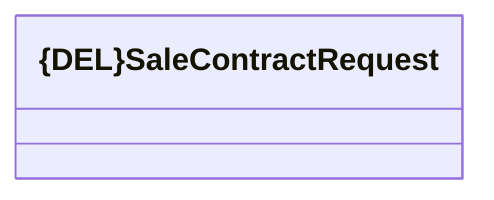

# Generated JMS messages - Contract Sale

- **Diagram Type**: Logical
- **Package**: HomerSelect/BSL/Analysis Model/_Interface/RabbitMQ messages/Generated RabbitMQ messages/Contract/Contract Sale
- **Diagram ID**: 63181
- **Elements**: 1
- **Connectors**: 0

