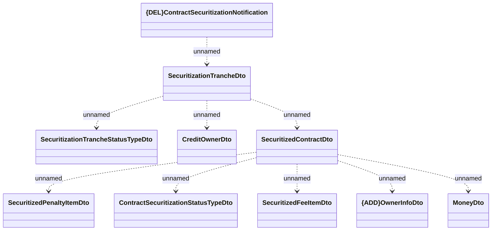

# Generated JMS messages - Contract Securitization

- **Diagram Type**: Logical
- **Package**: HomerSelect/BSL/Analysis Model/_Interface/RabbitMQ messages/Generated RabbitMQ messages/Contract/Contract Securitization
- **Diagram ID**: 147420
- **Elements**: 10
- **Connectors**: 9

