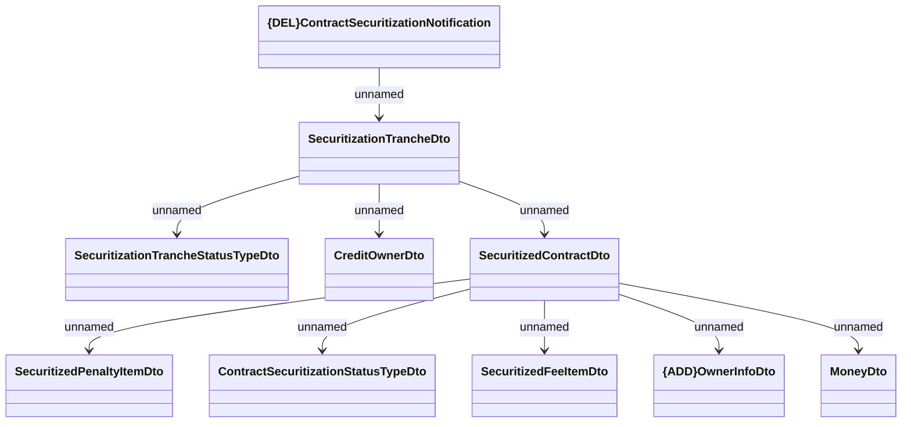

# Generated JMS messages - Contract Securitization

```mermaid
classDiagram
    class ADD_OwnerInfoDto["{ADD}OwnerInfoDto"]
    class SecuritizedPenaltyItemDto["SecuritizedPenaltyItemDto"]
    class SecuritizedFeeItemDto["SecuritizedFeeItemDto"]
    class SecuritizationTrancheStatusTypeDto["SecuritizationTrancheStatusTypeDto"]
    class CreditOwnerDto["CreditOwnerDto"]
    class MoneyDto["MoneyDto"]
    class ContractSecuritizationStatusTypeDto["ContractSecuritizationStatusTypeDto"]
    class SecuritizedContractDto["SecuritizedContractDto"]
    class SecuritizationTrancheDto["SecuritizationTrancheDto"]
    class DEL_ContractSecuritizationNotification["{DEL}ContractSecuritizationNotification"]
    SecuritizedContractDto --> SecuritizedPenaltyItemDto : unnamed
    SecuritizedContractDto --> ContractSecuritizationStatusTypeDto : unnamed
    SecuritizedContractDto --> SecuritizedFeeItemDto : unnamed
    SecuritizedContractDto --> ADD_OwnerInfoDto : unnamed
    SecuritizedContractDto --> MoneyDto : unnamed
    SecuritizationTrancheDto --> SecuritizedContractDto : unnamed
    SecuritizationTrancheDto --> CreditOwnerDto : unnamed
    SecuritizationTrancheDto --> SecuritizationTrancheStatusTypeDto : unnamed
    DEL_ContractSecuritizationNotification --> SecuritizationTrancheDto : unnamed
```
