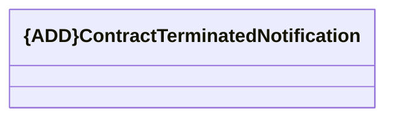

# Contract Terminated Notification

- **Diagram Type**: Logical
- **Package**: HomerSelect/BSL/Analysis Model/_Interface/RabbitMQ messages/Generated RabbitMQ messages/Contract/Contract Terminated Notification/Contract Terminated Notification V1
- **Diagram ID**: 127243
- **Elements**: 1
- **Connectors**: 0

