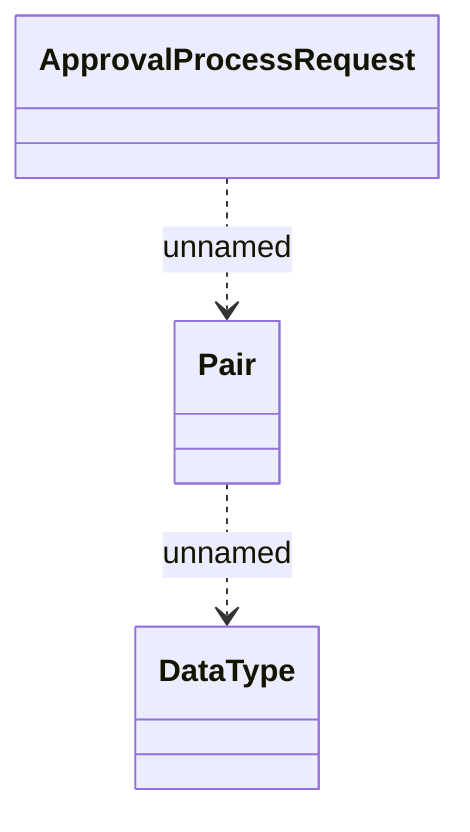

# Generated JMS messages - ApprovalProcessInvocationService

- **Diagram Type**: Logical
- **Package**: HomerSelect/BSL/Analysis Model/_Interface/RabbitMQ messages/Generated RabbitMQ messages/Contract/Contract approval
- **Diagram ID**: 64400
- **Elements**: 3
- **Connectors**: 2

