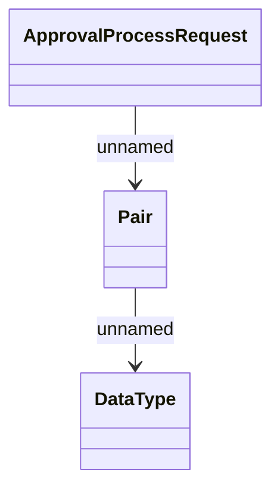

# Generated JMS messages - ApprovalProcessInvocationService

```mermaid
classDiagram
    class DataType["DataType"]
    class ApprovalProcessRequest["ApprovalProcessRequest"]
    class Pair["Pair"]
    Pair --> DataType : unnamed
    ApprovalProcessRequest --> Pair : unnamed
```
