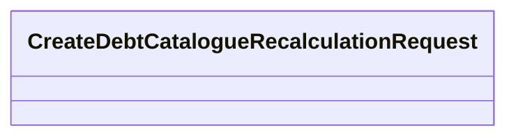

# CreateDebtCatalogueRecalculationRequest

- **Diagram Type**: Logical
- **Package**: HomerSelect/BSL/Analysis Model/_Interface/RabbitMQ messages/Generated RabbitMQ messages/Debt Catalogue Request/v1.0/CreateDebtCatalogueRecalculationRequest
- **Diagram ID**: 145628
- **Elements**: 1
- **Connectors**: 0

