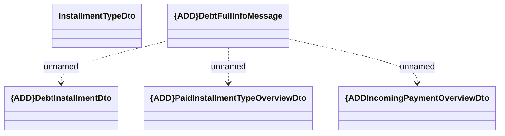

# {DEL}Debt full info

- **Diagram Type**: Logical
- **Package**: HomerSelect/BSL/Analysis Model/_Interface/RabbitMQ messages/Generated RabbitMQ messages/Debt/Debt Full Info
- **Diagram ID**: 155319
- **Elements**: 5
- **Connectors**: 3

