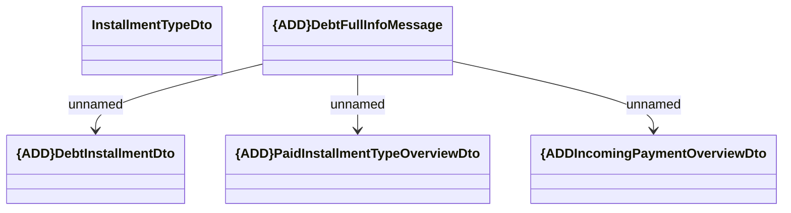

# {DEL}Debt full info

```mermaid
classDiagram
    class ADDIncomingPaymentOverviewDto["{ADDIncomingPaymentOverviewDto"]
    class ADD_PaidInstallmentTypeOverviewDto["{ADD}PaidInstallmentTypeOverviewDto"]
    class InstallmentTypeDto["InstallmentTypeDto"]
    class ADD_DebtInstallmentDto["{ADD}DebtInstallmentDto"]
    class ADD_DebtFullInfoMessage["{ADD}DebtFullInfoMessage"]
    ADD_DebtFullInfoMessage --> ADD_DebtInstallmentDto : unnamed
    ADD_DebtFullInfoMessage --> ADD_PaidInstallmentTypeOverviewDto : unnamed
    ADD_DebtFullInfoMessage --> ADDIncomingPaymentOverviewDto : unnamed
```
