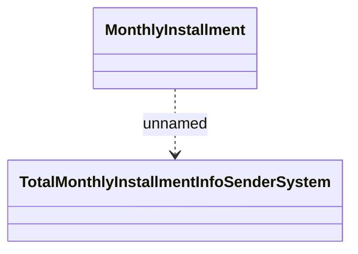

# Monthly Installment

- **Diagram Type**: Logical
- **Package**: HomerSelect/BSL/Analysis Model/_Interface/RabbitMQ messages/Generated RabbitMQ messages/Debt/Total Monthly Installment Info
- **Diagram ID**: 109906
- **Elements**: 2
- **Connectors**: 1

