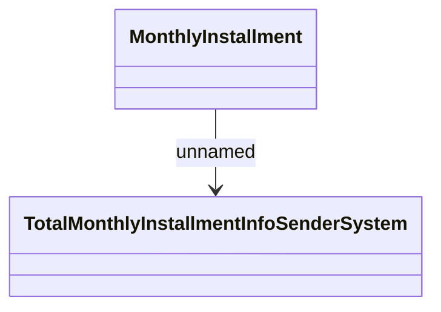

# Monthly Installment

```mermaid
classDiagram
    class TotalMonthlyInstallmentInfoSenderSystem["TotalMonthlyInstallmentInfoSenderSystem"]
    class MonthlyInstallment["MonthlyInstallment"]
    MonthlyInstallment --> TotalMonthlyInstallmentInfoSenderSystem : unnamed
```
