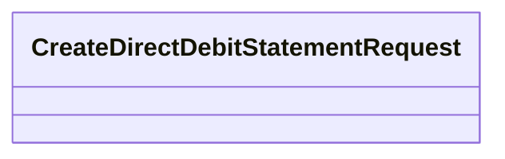

# CreateDirectDebitStatementRequest

- **Diagram Type**: Logical
- **Package**: HomerSelect/BSL/Analysis Model/_Interface/RabbitMQ messages/Generated RabbitMQ messages/Direct Debit Statements/v1.0/CreateDirectDebitStatementRequest
- **Diagram ID**: 151753
- **Elements**: 1
- **Connectors**: 0

